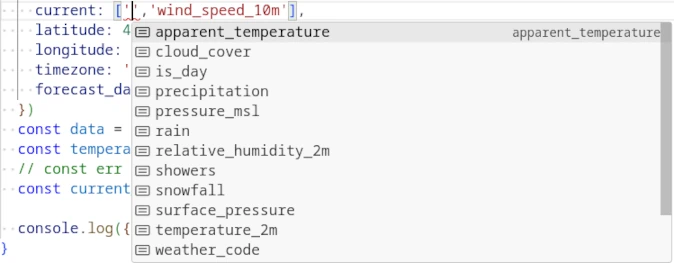

# OpenMeteo


This is a typesafe client for the [Open-Meteo Weather Forecast API](https://open-meteo.com/en/docs).
The Open-Meteo API gives you unified access to high-precision weather forecast data from
many national weather services.
The client is designed to utilize [TypeScript](https://www.typescriptlang.org/) for maximum type safety and [flatbuffers](https://flatbuffers.dev/index.html#flatbuffers_overview)
for best performance.

## Usage

```
npm install @atombrenner/openmeteo
```

Import the `fetchWeatherData` function. It needs a runtime that implements a basic [Fetch API](https://developer.mozilla.org/en-US/docs/Web/API/Fetch_API).

```typescript
import { fetchWeatherData } from '@atombrenner/openmeteo'
```

Fetch forecast data. The function accepts an object of type `WeatherDataParams` that mimics
the parameters of the Open-Meteo API as closely as possible. File an issue if you find
something missing. Fetching data for multiple locations in one request is not supported.

```typescript
const data = await fetchWeatherData({
  latitude: 49.0699764,
  longitude: 11.614277,
  timezone: 'Europe/Berlin',
  forecast_days: 5,
  hourly: ['temperature_2m', 'rain'],
  daily: ['temperature_2m_max', 'sunrise', 'sunset'],
  current: ['apparent_temperature'],
})
```

All hourly, daily and current parameters documented by [DWD ICON](https://open-meteo.com/en/docs/dwd-api) are currently supported.
The weather variables arrays for hourly, daily and current data are typed with string literals,
so autocompletion just works.



Access the returned data. Note that `daily` and `hourly` are time series and return an array of
values. All values are of type `number`. Duration and timestamps are returned as seconds.

```typescript
console.log(data.hourly.temperature_2m[0]) // temperature in the first hour
console.log(data.current.apparent_temperature)
```

The returned data is typed depending on the parameters, which means that only requested
variables are part of the return type.
If you have requested `hourly: ['rain']` and try to access `data.hourly.temperature_2m`,
TypeScript will raise a 'Property does not exist' error.
Without the `WeatherData` type depending on `WeatherDataParams` all properties
would need to be present and the user would need to do null checks all the time.


If you need to construct the parameter object dynamically,
you need the `as const` or the `weatherDataParams` utility function to prevent
type widening to string. See [examples](example.ts).

The returned data is modeled very closely to the JSON response of the Open-Meteo API.
There are a few caveats to be aware of:

- durations and timestamps are returned in `seconds` (type number)
- timestamps are always in UTC
- data contains `utc_offset_seconds` property for easy conversion to local time:
  ```typescript
  const localTime = (ts: number) => new Date((ts + data.utc_offset_seconds) * 1000)
  ```

## Notes

- The [flatbuffers](https://flatbuffers.dev/index.html#flatbuffers_overview) optimization idea was
  borrowed from the [openmeteo](https://www.npmjs.com/package/openmeteo) package.
  Flatbuffers indeed reduce the size of the transferred data but the absolute saving is rather small
  unless you request a lot of variables for many intervals. Anyway, it was fun to learn flatbuffers,
  and using a performant code just feels good 😁.
- Uses [Bun](https://bun.sh/) for development and running tests.
- If you want retries on network errors use something like [retry](https://www.npmjs.com/package/retry).

## Publish

Useful commands

- `npm version <major|minor|patch>`
- `git push --tags` starts the workflow for publishing an new package
- `npm pack` creates a package, useful for local testing
- `npm publish --dry-run` check package before publishing
- `npm publish --access public`
